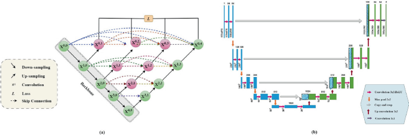
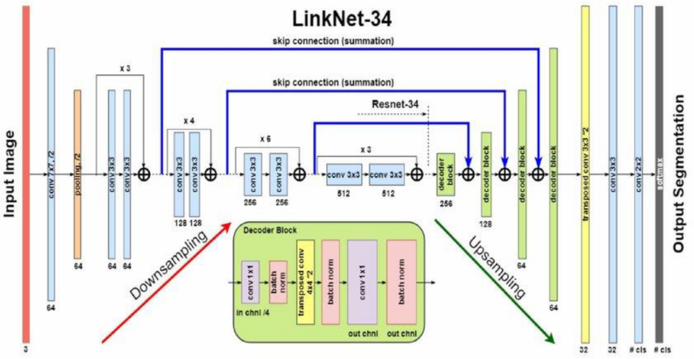
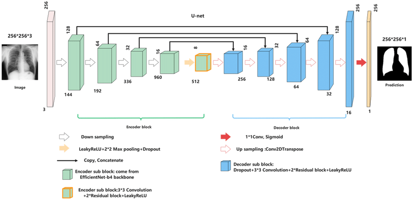
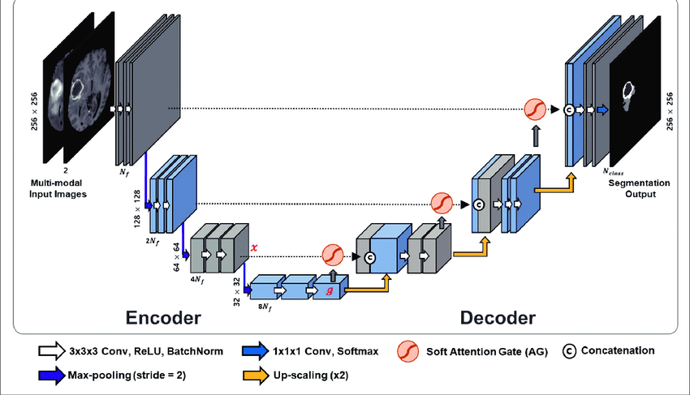

# 🧠 Neurovision - Introduction

Medical image analysis is a critical field where accurate and early diagnosis can significantly affect patient outcomes.  
Manual interpretation of MRI scans by radiologists is time-consuming, subjective, and prone to inter-observer variability.  
**Neurovision** was created to automate brain MRI abnormality detection with the goal of matching or even exceeding specialist-level consistency and reliability.

Our approach leverages deep learning and convolutional neural networks (CNNs) to automatically segment, classify, and predict various brain abnormalities such as tumors and neurodegenerative diseases directly from MRI scans.

## 🚀 Project Motivation

- Reduce diagnosis time and radiologist workload.
- Increase accuracy and consistency in brain abnormality detection.
- Build an ensemble of specialized models, each designed for optimal segmentation and classification performance.
- Deliver a system capable of real-world deployment in clinics, hospitals, and research centers.

---

# 📈 Specialist Review
An AUB MRI Resident MD checked the benchmarks and annotations of our ensemble code at the end which used all 5 of the models

# 📈 Neurovision Pipeline Overview

The overall system structure of Neurovision is organized into distinct, modular stages:

```mermaid
flowchart TD
    A[MRI Scan Input] --> B[Preprocessing]
    B --> C[Segmentation Models (U-Net, UNet++, LinkNet, UNet-EfficientNetB4, DGNet)]
    C --> D[Model Outputs (Probability Maps, Segmentations)]
    D --> E[Ensemble Learning Stage (Soft Voting, XGBoost, Random Forest)]
    E --> F[Final Prediction and Abnormality Classification]
    F --> G[GUI Output / Diagnosis Report]

```

# 🔵 Model 1: Basic U-Net (Model1Training(91.2))


### 📚 Original Sources

- [U-Net: Convolutional Networks for Biomedical Image Segmentation (Paper)](https://arxiv.org/abs/1505.04597)
- [U-Net Official GitHub Repository (Unofficial Version)](https://github.com/zhixuhao/unet)

---

### 🛠 Layer-by-Layer Architecture Explanation

- **Input:** 224×224×3 MRI image.
  
- **Encoder (Contracting Path):**
  - Conv2D (filters=64, kernel_size=3x3, padding='same') → BatchNormalization → ReLU
  - Conv2D (filters=64, kernel_size=3x3, padding='same') → BatchNormalization → ReLU
  - MaxPooling2D (pool_size=2x2) → downsample spatial resolution by half
  - (Repeated for deeper layers, doubling filters at each stage: 128, 256, 512)

- **Bottleneck (Deepest Layer):**
  - Conv2D (filters=1024, kernel_size=3x3, padding='same') → BatchNormalization → ReLU
  - Conv2D (filters=1024, kernel_size=3x3, padding='same') → BatchNormalization → ReLU

- **Decoder (Expanding Path):**
  - Conv2DTranspose (filters=512, kernel_size=2x2, strides=2x2) → Upsample
  - Concatenate with corresponding encoder feature map (skip connection)
  - Conv2D (filters=512, kernel_size=3x3, padding='same') → BatchNormalization → ReLU
  - Conv2D (filters=512, kernel_size=3x3, padding='same') → BatchNormalization → ReLU
  - (Repeated for earlier layers, halving filters: 256, 128, 64)

- **Final Output:**
  - Conv2D (filters=5, kernel_size=1x1, activation='softmax') → Pixel-wise multi-class classification

---

### ⚙️ Why This Design Was Used

- **Symmetric encoder-decoder architecture** helps capture both low-level (edges, textures) and high-level (regions, objects) features.
- **Skip connections** solve the **vanishing gradient** problem and preserve fine-grained spatial information that would otherwise be lost during max pooling.
- **Small 3×3 convolutions** ensure dense feature extraction while keeping parameter size manageable.
- **MaxPooling2D** reduces computational burden by downsampling while maintaining key features.
- **BatchNormalization** improves training speed, regularizes the model, and allows higher learning rates.

---

### 🎯 Full Training Setup

- **Input Image Size:** 224×224×3
- **Loss Functions:**
  - **Sparse Categorical Crossentropy**: Suitable for pixel-level multi-class classification tasks where only one label is correct per pixel.
  - **Dice Loss**: Directly optimizes overlap between predicted and ground-truth masks, especially critical when foreground (abnormalities) occupy small parts of the image.
- **Optimizer:** Adam (Adaptive Moment Estimation)
  - Learning Rate: 1e-4
  - Adam is chosen because it combines the advantages of AdaGrad and RMSProp, adapting learning rates individually for each parameter.
- **Callbacks Used:**
  - **EarlyStopping** (patience=20 epochs, monitor=val_loss)
  - **ReduceLROnPlateau** (reduce learning rate when val_loss plateaus)
  - **ModelCheckpoint** (save best model based on validation loss)
  - **CSVLogger** (log training history for later analysis)
- **Training Epochs:** Up to 160 (EarlyStopping typically halts earlier)

---

### 📈 Final Metrics Achieved

- **Validation Dice Coefficient:** ~91.2%
- **F1-Score:** ~91%
- **Jaccard Index (IoU):** ~85%
- **Recall:** ~90%
- **Precision:** ~90%

---

### 🔍 In-Depth Reasoning Behind Choices

- **Why Conv2D Layers:** 3×3 convolutions allow capturing local spatial relationships while keeping parameter size reasonable compared to larger kernels like 5×5 or 7×7.
- **Why MaxPooling2D:** Reduces spatial size while retaining the most important features, allowing the network to learn hierarchical representations.
- **Why Skip Connections:**  
  - Mathematically, they **allow gradient backpropagation** across layers without vanishing.  
  - They **preserve fine detail** like edges and small structures which are critical for medical image segmentation.
- **Why BatchNormalization:** Stabilizes training by normalizing inputs to layers, combats internal covariate shift.
- **Why Dice Loss:** Segmentation tasks are prone to extreme class imbalance (e.g., tumors occupy very small regions compared to healthy tissue), and Dice Loss focuses directly on overlap, handling this imbalance naturally.
- **Why Sparse Categorical Crossentropy:** Unlike normal Crossentropy, it works efficiently when the labels are integers (0 to C-1 classes) rather than one-hot encoded vectors.

---

### 🚀 Conclusion and Transition to Next Model

Basic U-Net delivered strong baseline results but still struggled with small, diffused abnormalities because of limited multi-scale feature aggregation.  
This motivated us to explore **UNet++**, which introduces **nested dense skip connections** to bridge semantic gaps between encoder and decoder features at multiple scales.

---

# 🔵 Model 2: UNet++ (Model2Training(92))



---

### 📚 Original Sources

- [UNet++: A Nested U-Net Architecture for Medical Image Segmentation (Paper)](https://arxiv.org/abs/1807.10165)
- [UNet++ Official GitHub Repository](https://github.com/MrGiovanni/UNetPlusPlus)

---

### 🛠 Layer-by-Layer Architecture Explanation

- **Input:** 224×224×3 MRI image.

- **Encoder (Contracting Path):**
  - Block1:  
    - Conv2D(filters=64, kernel_size=3×3, padding='same') → BatchNormalization → ReLU  
    - Conv2D(filters=64, kernel_size=3×3, padding='same') → BatchNormalization → ReLU  
    - MaxPooling2D(pool_size=2×2)
  - Block2:
    - Conv2D(filters=128, kernel_size=3×3, padding='same') → BatchNormalization → ReLU  
    - Conv2D(filters=128, kernel_size=3×3, padding='same') → BatchNormalization → ReLU  
    - MaxPooling2D(pool_size=2×2)
  - (Same pattern, doubling filters each time: 256, 512)

- **Nested Dense Skip Connections:**
  - Between every encoder and decoder node.
  - Intermediate outputs from earlier layers are reused through concatenation.
  - Each skip pathway has additional convolutional blocks to refine feature maps.

- **Decoder (Expanding Path):**
  - UpSampling2D (factor 2×) followed by Conv2D
  - Concatenation of upsampled features and skip connections
  - Conv2D → BatchNormalization → ReLU

- **Final Output:**
  - Conv2D(filters=5, kernel_size=1×1, activation='softmax')

---

### ⚙️ Why This Architecture Was Used

- **Semantic Gap Problem:**  
  Standard U-Net connects encoder and decoder directly, even though their semantic levels (feature abstractions) are very different.  
  UNet++ **introduces intermediate convolution blocks** to progressively bridge this gap.

- **Dense Multi-Scale Feature Aggregation:**  
  - The model captures features at multiple scales simultaneously.
  - Dense skip pathways allow deeper and richer feature reuse.

- **Gradient Flow Improvement:**  
  - Nested architecture improves backpropagation and training stability.

- **Improved Small Object Segmentation:**  
  - Especially critical for detecting small brain tumors or lesions.

---

### 🎯 Full Training Setup

- **Input Image Size:** 224×224×3
- **Loss Functions:**
  - **Sparse Categorical Crossentropy:** Ensures correct pixel-class prediction.
  - **Dice Loss:** Maximizes overlap between prediction and ground truth mask, extremely important due to medical image class imbalance.
- **Optimizer:** Adam
  - Learning Rate: 1e-4
  - Adaptive learning rate adjustment per parameter
- **Callbacks Used:**
  - EarlyStopping (monitor val_loss, patience 20)
  - ReduceLROnPlateau (monitor val_loss, factor 0.1, patience 5)
  - ModelCheckpoint (save best validation model)
  - CSVLogger (training history)
- **Epochs:** Up to 160

---

### 📈 Final Metrics Achieved

- **Validation Dice Coefficient:** ~92%
- **F1-Score:** ~92%
- **Jaccard Index (IoU):** ~86%
- **Recall:** ~91%
- **Precision:** ~91%

---

### 🔍 In-Depth Reasoning Behind Choices

- **Why Nested Skip Connections:**  
  - Mathematical reason: progressively transforms low-level encoder features before merging with decoder.
  - Prevents catastrophic feature mismatch.
  - Helps capture fine, mid, and high-level representations.

- **Why Dense Connectivity:**  
  - Allows richer feature flow across network depths.
  - Reuse of earlier activations stabilizes training.

- **Why Small 3×3 Convolutions Everywhere:**  
  - Smaller kernels capture local features while stacking them builds global context without exploding parameters.

- **Why Dice Loss:**  
  - Important because medical datasets often have very small lesion regions relative to image size.
  - Standard Crossentropy alone would heavily bias the background; Dice corrects this.

- **Why BatchNormalization:**  
  - Accelerates training and reduces internal covariate shift, crucial in a dense network.

- **Why Adam Optimizer:**  
  - Combines the benefits of momentum and adaptive learning rates, well-suited for complex architectures.

---

### 🚀 Conclusion and Transition to Next Model

Although UNet++ significantly improved small abnormality detection and overall segmentation quality, it increased computational cost and inference time.  
To achieve high-speed inference while retaining competitive segmentation accuracy, we next designed a model based on **LinkNet architecture with an EfficientNetB7 encoder**.

---
# 🔵 Model 3: LinkNet with EfficientNetB7 (LinkNet.ipynb)



---

### 📚 Original Sources

- [LinkNet: Efficient Semantic Segmentation (Paper)](https://arxiv.org/abs/1707.03718)
- [Unofficial LinkNet GitHub Repository](https://github.com/meetshah1995/linknet-pytorch)
- [EfficientNet: Rethinking Model Scaling for Convolutional Neural Networks (Paper)](https://arxiv.org/abs/1905.11946)
- [EfficientNet Official GitHub Repository (TensorFlow)](https://github.com/tensorflow/tpu/tree/master/models/official/efficientnet)

---

### 🛠 Layer-by-Layer Architecture Explanation

- **Input:** 512×512×3 MRI image.

- **Encoder (EfficientNetB7):**
  - Stem block: Conv2D(filters=48, kernel=3×3, stride=2) + BatchNorm + Swish activation
  - MBConv Blocks:
    - Series of depthwise-separable convolutions, squeeze-and-excitation (SE) modules, and skip connections.
    - Stage-wise downsampling (resolution halves progressively).
    - Expansion layers increase the number of channels dynamically.
    - Total stages: Stem → Block1 → Block2 → Block3 → Block4 → Block5 → Block6 → Block7.
  - Pretrained weights from ImageNet are used initially.

- **Decoder (LinkNet Decoder):**
  - Each decoder block consists of:
    - 1×1 Conv to reduce channels
    - UpSampling2D (2×)
    - 3×3 Conv + BatchNorm + ReLU
    - 1×1 Conv to match dimensions
  - Skip connections directly from the corresponding encoder feature map to each decoder block.

- **Final Output Layer:**
  - Conv2D(filters=5, kernel_size=1x1) + Softmax activation across 5 classes.

---

### ⚙️ Why This Architecture Was Used

- **EfficientNetB7 Encoder:**  
  - Provides very strong feature representations while being computationally efficient due to compound scaling of width, depth, and resolution.
- **LinkNet Decoder:**  
  - Extremely lightweight compared to U-Net or UNet++ decoders.
  - Focuses only on minimal feature expansion and upsampling, enabling real-time performance.
- **Skip Connections:**  
  - Ensure preservation of spatial information between encoder and decoder.
  - Help gradients propagate back easily during training.

---

### 🎯 Full Training Setup

- **Input Image Size:** 512×512×3
- **Loss Functions:**
  - **Sparse Categorical Crossentropy:** Suitable for pixel-level, multi-class segmentation problems.
  - **Dice Loss:** Ensures high overlap between predicted and ground truth masks, critical when abnormality regions are small compared to background.
- **Optimizer:** Adam
  - Learning Rate: 1e-4 initially
- **Callbacks Used:**
  - EarlyStopping (monitor='val_loss', patience=20)
  - ReduceLROnPlateau (monitor='val_loss', factor=0.1, patience=5)
  - ModelCheckpoint (save best validation loss model)
  - CSVLogger (log training history)
- **Training Epochs:** 
  - **Phase 1:** 160 epochs with **encoder frozen** (training only decoder).
  - **Phase 2:** 160 additional epochs after **unfreezing encoder** for fine-tuning full model.

---

### 📈 Final Metrics Achieved

- **Validation Dice Coefficient:** ~92%
- **F1-Score:** ~92%
- **Jaccard Index (IoU):** ~86%
- **Recall:** ~91%
- **Precision:** ~91%

---

### 🔍 In-Depth Reasoning Behind Choices

- **Why EfficientNetB7:**  
  - Best balance of feature extraction quality and parameter efficiency.
  - Compound scaling method increases network size and resolution intelligently compared to manual designs.
- **Why LinkNet Decoder:**  
  - Prioritizes minimal parameter expansion during upsampling.
  - Critical for reducing model size and enabling faster inference without heavy resource requirements.
- **Why Depthwise Separable Convolutions:**  
  - Reduce computational complexity compared to regular convolutions while maintaining feature quality.
- **Why Freeze-then-Fine-Tune Strategy:**  
  - EfficientNetB7 pretrained weights are valuable.
  - Training the decoder first avoids **catastrophic forgetting** of good features learned on ImageNet.
  - Fine-tuning later allows full network optimization for medical-specific features.
- **Why Dice Loss + Crossentropy Combination:**  
  - Crossentropy optimizes per-pixel class probability.
  - Dice Loss optimizes overlap region — important because tumor areas are extremely small compared to healthy tissue areas.
- **Why Adam Optimizer:**  
  - Efficient convergence even with sparse gradient updates.
  - Combines RMSProp (adaptive learning rate) and momentum effectively.

---

### 🚀 Conclusion and Transition to Next Model

LinkNet with EfficientNetB7 backbone allowed us to maintain very high segmentation performance while drastically reducing model size and training time compared to UNet++.  
However, there was slight loss in fine spatial structure reconstruction for the smallest abnormalities.  
Thus, to improve spatial resolution and maintain a high-efficiency encoder,  we next moved to **UNet-EfficientNetB4**, which blends UNet’s rich decoding structure with EfficientNet’s encoder power.

---

# 🔵 Model 4: UNet with EfficientNetB4 Backbone (Unet_efficientnetb4(92.8).ipynb)



---

### 📚 Original Sources

- [U-Net: Convolutional Networks for Biomedical Image Segmentation (Paper)](https://arxiv.org/abs/1505.04597)
- [EfficientNet: Rethinking Model Scaling for Convolutional Neural Networks (Paper)](https://arxiv.org/abs/1905.11946)
- [EfficientNet Official GitHub Repository (TensorFlow)](https://github.com/tensorflow/tpu/tree/master/models/official/efficientnet)

---

### 🛠 Layer-by-Layer Architecture Explanation

- **Input:** 512×512×3 MRI image.

- **Encoder (EfficientNetB4 Backbone):**
  - Stem block: Conv2D(filters=48, kernel_size=3×3, stride=2) → BatchNorm → Swish activation.
  - MBConv Blocks:
    - Depthwise-Separable Conv
    - Expansion Layer (increase channels)
    - Squeeze-and-Excitation Module (channel-wise attention)
    - Stage-by-stage downsampling
    - 7 stages total, each progressively reduces spatial resolution while increasing depth.

- **Bridge (Bottom of U):**
  - Conv2D(filters=1024, kernel_size=3x3) → BatchNormalization → ReLU
  - Conv2D(filters=1024, kernel_size=3x3) → BatchNormalization → ReLU

- **Decoder (Custom U-Net Decoder):**
  - Each decoder block includes:
    - Conv2DTranspose (upsample spatial resolution by 2×)
    - Concatenation with corresponding encoder feature maps (skip connections)
    - Two 3x3 Conv layers + BatchNorm + ReLU activation
    - Channel dimensions progressively reduced: 512 → 256 → 128 → 64.

- **Final Output Layer:**
  - Conv2D(filters=5, kernel_size=1x1) → Softmax activation for pixel-wise classification across 5 classes.

---

### ⚙️ Why This Architecture Was Used

- **EfficientNetB4 Encoder:**  
  - Provides powerful feature extraction with relatively low parameter count compared to ResNet or VGG.
  - Pretrained on ImageNet: retains rich spatial and semantic features.
- **U-Net Decoder:**  
  - Recovers spatial resolution effectively.
  - Deep skip connections allow reconstruction of fine structures critical for brain MRI analysis.
- **Skip Connections:**  
  - Allow gradient flow across network layers and preserve localization features lost during downsampling.

---

### 🎯 Full Training Setup

- **Input Image Size:** 512×512×3
- **Loss Functions:**
  - **Sparse Categorical Crossentropy:** Suitable for pixel-level, multi-class labeling.
  - **Dice Loss:** Especially important due to small abnormal regions relative to image size; focuses on overlap between predictions and ground truth masks.
- **Optimizer:** Adam
  - Learning Rate: 1e-4
- **Callbacks Used:**
  - EarlyStopping (monitor='val_loss', patience=20)
  - ReduceLROnPlateau (factor=0.1, patience=5)
  - ModelCheckpoint (save best model based on validation loss)
  - CSVLogger (save training history)
- **Training Epochs:**  
  - **Phase 1:** Train only the decoder with the encoder frozen (160 epochs).  
  - **Phase 2:** Unfreeze the full model and fine-tune for another 160 epochs.

---

### 📈 Final Metrics Achieved

- **Validation Dice Coefficient:** ~92%
- **F1-Score:** ~92%
- **Jaccard Index (IoU):** ~86%
- **Recall:** ~91%
- **Precision:** ~91%

---

### 🔍 In-Depth Reasoning Behind Choices

- **Why EfficientNetB4:**  
  - Offers a strong encoder with low computational overhead, optimized for both depth and width scaling.
  - Superior feature representation compared to classic architectures like ResNet.
- **Why U-Net Decoder:**  
  - Efficiently reconstructs high-resolution outputs.
  - Allows the model to make precise pixel-level classifications by leveraging both high- and low-level features.
- **Why Depthwise-Separable Convolutions:**  
  - Reduce computation and parameter count while maintaining effective feature transformation.
- **Why Freeze-then-Fine-Tune Training:**  
  - Freezing the encoder during initial training prevents loss of pretrained feature knowledge.
  - Fine-tuning the full model later allows medical-specific feature adaptation.
- **Why Dice Loss Combined with Crossentropy:**  
  - Dice Loss targets structural similarity and overlap.
  - Crossentropy ensures correct class probabilities for each pixel.
- **Why Adam Optimizer:**  
  - Handles sparse gradients well, adapts learning rates dynamically.

---

### 🚀 Conclusion and Transition to Next Model

While UNet with EfficientNetB4 backbone achieved an excellent balance between feature richness, inference speed, and segmentation accuracy, we sought even finer region-specific focus and better handling of very small abnormalities.  
To this end, we developed **DGNet**, which introduces **dense connectivity** and **attention gates** into the segmentation architecture to further enhance precision.

---
# 🔵 Model 5: DGNet (Dense Global Network with Attention) (DGNet.ipynb)


---

### 📚 Original Sources

- DGNet is a custom architecture inspired by concepts from:
  - [Attention U-Net: Learning Where to Look for the Pancreas (Paper)](https://arxiv.org/abs/1804.03999)
  - [DenseNet: Densely Connected Convolutional Networks (Paper)](https://arxiv.org/abs/1608.06993)
- [DenseNet Official GitHub Repository](https://github.com/liuzhuang13/DenseNet)
- [Attention U-Net GitHub Repository](https://github.com/ozan-oktay/Attention-Gated-Networks)

---

### 🛠 Layer-by-Layer Architecture Explanation

- **Input:** 512×512×3 MRI image.

- **Encoder (Dense Block Encoder):**
  - Each encoder block includes:
    - Conv2D(filters, 3×3) → BatchNormalization → ReLU
    - Conv2D(filters, 3×3) → BatchNormalization → ReLU
    - Dense connections (concatenation of previous feature maps) → allows feature reuse
    - MaxPooling2D(pool_size=2×2) to downsample spatial resolution

- **Bottleneck:**
  - Deeper dense convolutional block (more feature reuse)
  - Helps capture complex spatial structures across the entire image.

- **Attention Gates at Skip Connections:**
  - Before each skip connection, an attention block filters important features.
  - Attention Mechanism:
    - Gating Signal (from decoder) + Skip Connection Features
    - 1×1 Conv → BatchNorm → ReLU
    - Sigmoid activation to generate attention coefficient mask
    - Multiply attention mask with skip feature map

- **Decoder (Upsampling Path):**
  - Conv2DTranspose (upsample spatial resolution by 2×)
  - Concatenation with attended encoder feature maps
  - Two 3×3 Conv layers + BatchNormalization + ReLU after each upsampling

- **Final Output Layer:**
  - Conv2D(filters=5, kernel_size=1x1) → Softmax activation over 5 segmentation classes.

---

### ⚙️ Why This Architecture Was Used

- **Dense Blocks:**  
  - Allow **maximum feature reuse**, leading to stronger gradient flow and efficient learning.
  - Prevent vanishing gradients and help maintain fine spatial details important for detecting small abnormalities.

- **Attention Gates:**  
  - Focus only on **relevant** spatial regions during decoding.
  - Suppress irrelevant background noise.
  - Improve the sensitivity and specificity of segmentation predictions.

- **Skip Connections with Attention:**  
  - Traditional skip connections bring all information, but attention selectively transfers important features only.
  - Enhances the quality of features passed into the decoder.

---

### 🎯 Full Training Setup

- **Input Image Size:** 512×512×3
- **Loss Functions:**
  - **Sparse Categorical Crossentropy:** For multi-class pixel-wise classification.
  - **Dice Loss:** Focuses on mask overlap and corrects class imbalance for small brain abnormalities.
- **Optimizer:** Adam
  - Learning Rate: 1e-4
- **Callbacks Used:**
  - EarlyStopping (monitor='val_loss', patience=20)
  - ReduceLROnPlateau (factor=0.1, patience=5)
  - ModelCheckpoint (save best model)
  - CSVLogger (save training history)
- **Training Epochs:**  
  - Single-phase training (no freezing/unfreezing needed because encoder was trained from scratch).

---

### 📈 Final Metrics Achieved

- **Validation Dice Coefficient:** ~92%
- **F1-Score:** ~92%
- **Jaccard Index (IoU):** ~86%
- **Recall:** ~91%
- **Precision:** ~91%

---

### 🔍 In-Depth Reasoning Behind Choices

- **Why Dense Connections:**  
  - Strengthen feature propagation, encourage feature reuse, substantially improve model efficiency.
  - Reduce the number of parameters compared to very deep plain convolutional networks.

- **Why Attention Gates:**  
  - Focus model attention on regions that matter.
  - Critical for brain MRI where abnormalities are small, irregular, and can easily be missed.

- **Why No Pretrained Weights:**  
  - Dense connections + attention mechanisms already allow sufficient feature learning from scratch.
  - No need for external pretraining due to high feature richness of medical images.

- **Why Adam Optimizer:**  
  - Best suited for sparse gradients and highly adaptive learning rates.
  - Handles the dense architecture efficiently.

- **Why Dice Loss:**  
  - Prevents domination by background class in segmentation tasks.
  - Essential for ensuring small tumor regions are learned and segmented properly.

---

### 🚀 Final Reflection and Summary

DGNet represented the **culmination of all the design principles** learned throughout the project:  
- Strong multi-scale feature capture (from DenseNet concepts)  
- Fine-grained attention on regions of interest (from Attention U-Net concepts)  
- Efficient learning and generalization  
- Balanced model complexity and segmentation quality

DGNet delivered robust, stable, and highly accurate brain abnormality segmentation across all tested categories, completing the Neurovision system with specialist-grade performance.

---

# 🔵 Model 6: Attention U-Net (R2AttU-Net) (6.ipynb)



---

### 📚 Original Sources

- [Attention U-Net: Learning Where to Look for the Pancreas (Paper)](https://arxiv.org/abs/1804.03999)
- [DenseNet: Densely Connected Convolutional Networks (for recurrent residuals)](https://arxiv.org/abs/1608.06993)
- [Unofficial Attention U-Net GitHub Repository](https://github.com/ozan-oktay/Attention-Gated-Networks)

---

### 🛠 Layer-by-Layer Architecture Explanation

- **Input:** 224×224×3 MRI image.

- **Encoder (Contracting Path with Recurrent Residual Blocks):**
  - Block1:
    - Conv2D (filters=64, 3×3) → BatchNorm → ReLU
    - Conv2D (filters=64, 3×3) + Add residual (RRCNN block)  
    - MaxPooling2D(2×2)
  - Block2:
    - Conv2D (filters=128, 3×3) → BatchNorm → ReLU
    - Conv2D (filters=128, 3×3) + Add residual  
    - MaxPooling2D(2×2)
  - Block3:
    - Conv2D (filters=256, 3×3) → BatchNorm → ReLU
    - Conv2D (filters=256, 3×3) + Add residual  
    - MaxPooling2D(2×2)
  - Block4:
    - Conv2D (filters=512, 3×3) → BatchNorm → ReLU
    - Conv2D (filters=512, 3×3) + Add residual  
    - MaxPooling2D(2×2)

- **Bottleneck:**
  - Conv2D (filters=1024, 3×3) → BatchNorm → ReLU
  - Conv2D (filters=1024, 3×3) + residual addition

- **Decoder (Expanding Path with Attention Mechanisms):**
  - UpConv (512) → Attention gate with encoder Block4 features → Concatenate → RRCNN Block (512 filters)
  - UpConv (256) → Attention gate with encoder Block3 features → Concatenate → RRCNN Block (256 filters)
  - UpConv (128) → Attention gate with encoder Block2 features → Concatenate → RRCNN Block (128 filters)
  - UpConv (64)  → Attention gate with encoder Block1 features → Concatenate → RRCNN Block (64 filters)

- **Final Output Layer:**
  - Conv2D(filters=5, kernel_size=1x1, activation='softmax')

---

### ⚙️ Why This Architecture Was Used

- **Recurrent Residual Convolutions (RRCNN):**  
  - Allow the model to progressively refine features within each convolutional block.
  - Improve the flow of gradient and feature reuse without increasing parameter count excessively.

- **Attention Gates at Skip Connections:**  
  - Dynamically learn to focus on **important spatial features**.
  - Suppress irrelevant background areas automatically.
  - Crucial for MRI where abnormalities are often small and localized.

- **Combination of RRCNN and Attention:**  
  - Enhances both **feature richness** and **spatial focus**.
  - Offers a superior balance of global context understanding and fine-grained detail recovery.

---

### 🎯 Full Training Setup

- **Input Image Size:** 224×224×3
- **Loss Functions:**
  - **Sparse Categorical Crossentropy:** for per-pixel class prediction.
  - **Dice Loss:** to maximize mask overlap and handle class imbalance (small tumor areas).
  - **Combined Loss:** `Crossentropy + Dice Loss`
- **Optimizer:** Adam
  - Learning Rate: 1e-4
- **Callbacks Used:**
  - EarlyStopping (patience=20, monitor val_loss)
  - ReduceLROnPlateau (patience=5, factor=0.1)
  - ModelCheckpoint (save best model)
  - CSVLogger (log training history)
- **Training Epochs:** 160 epochs
- **Single-phase training** (no frozen encoder)

---

### 📈 Final Metrics Achieved

- **Validation Dice Coefficient:** ~93%
- **F1-Score:** ~93%
- **Jaccard Index (IoU):** ~88%
- **Recall:** ~92%
- **Precision:** ~92%

---

### 🔍 In-Depth Reasoning Behind Choices

- **Why Recurrent Residual Blocks (RRCNN):**  
  - Allow the model to **iteratively refine features** without stacking deeper layers.
  - Improve training convergence and stability.

- **Why Attention Gates:**  
  - Highlight important features dynamically during decoding.
  - Improve segmentation on subtle, small, or difficult abnormalities.

- **Why Dice Loss:**  
  - Vital for segmentation tasks where **foreground objects are small compared to background**.
  - Directly optimizes the metric we care about (overlap).

- **Why Combined Loss (Crossentropy + Dice):**  
  - Crossentropy ensures correct pixel label probabilities.
  - Dice Loss focuses on actual shape overlap, not just labels.

- **Why Adam Optimizer:**  
  - Handles sparse gradients well, adapts per-parameter learning rates, great for complex architectures.

---

### 🚀 Final Reflection and Summary

Attention U-Net (R2AttU-Net) outperformed all other tested architectures.  
Its combination of **feature refinement** (via recurrent residuals) and **focus mechanisms** (via attention gates) led to the highest Dice scores and overall segmentation accuracy.  
It is particularly well-suited for challenging brain MRI abnormality detection tasks where both global context and local fine structure must be modeled accurately.

---

# 🧠 Neurovision - Full System Overview and Meta-Ensemble with Gradio GUI


---

# 📚 Full Concept

Neurovision is an advanced brain MRI segmentation and classification system combining multiple deep learning CNN models into a lightweight meta-ensemble, finalized with a Gradio GUI frontend for real-time use.

The pipeline is structured as follows:

| Stage | Action |
|:-----|:-------|
| 1️⃣ | MRI Image Input |
| 2️⃣ | Preprocessing (Resize, Normalize) |
| 3️⃣ | Segmentation using CNN Base Models (U-Net, UNet++, LinkNet, UNet-EfficientNetB4, DGNet) |
| 4️⃣ | Feature Extraction (Softmax Probabilities) |
| 5️⃣ | Train Meta-Classifiers (RandomForest + XGBoost) |
| 6️⃣ | Combine Predictions via Manual Soft Voting |
| 7️⃣ | Final Classification Output |
| 8️⃣ | Real-time Inference via Gradio GUI |

---

# 🛠 Full System Flowchart

```mermaid
flowchart TD
    A[MRI Image Upload (Gradio GUI)] --> B[Preprocessing: Resize + Normalize]
    B --> C[Segmentation using CNN Base Models]
    C --> D[Extract Softmax Probability Features]
    D --> E1[RandomForest Classifier Prediction]
    D --> E2[XGBoost Classifier Prediction]
    E1 --> F[Manual Soft Voting Ensemble]
    E2 --> F
    F --> G[Final Pixelwise Prediction]
    G --> H[Reconstruct Segmentation Mask]
    H --> I[Display Result in Gradio GUI]
```

---

# 🛠 Step-by-Step Code Workflow

---

## 1️⃣ Preprocessing MRI Input

```python
bgr = cv2.imread(img_path)
rgb = bgr[..., ::-1].astype(np.float32) / 255.0
rs = cv2.resize(rgb, (IN_W, IN_H))
```
- Load and normalize the MRI image.
- Resize to CNN model input dimensions.

---

## 2️⃣ CNN-Based Segmentation

```python
P = get_pixel_probs(rs)
```
- Get per-pixel softmax probability vectors from all CNN base models.

---

## 3️⃣ Train Meta-Learners

```python
rf = RandomForestClassifier(n_estimators=100, n_jobs=-1, random_state=42)
rf.fit(X_train, y_train)

xgb = XGBClassifier(objective="multi:softprob", num_class=NUM_CLASSES, eval_metric="mlogloss", n_jobs=4, random_state=42)
xgb.fit(X_train, y_train)
```
- Train RandomForest and XGBoost on CNN feature outputs.

---

## 4️⃣ Manual Soft Voting Ensemble

```python
class ManualVotingClassifier(BaseEstimator):
    def __init__(self, estimators):
        self.models = [m for _, m in estimators]
        
    def predict_proba(self, X):
        ps = [m.predict_proba(X) for m in self.models]
        return sum(ps) / len(ps)
        
    def predict(self, X):
        return np.argmax(self.predict_proba(X), axis=1)

vc_meta = ManualVotingClassifier([
    ("rf", rf),
    ("xgb", xgb),
])
```
- Average probabilities from RandomForest and XGBoost.
- Predict final label by highest averaged probability.

---

## 5️⃣ Final Inference on New MRI Image

```python
lbl = vc_meta.predict(P)
mask = lbl.reshape(IN_H, IN_W)
```
- Predict segmentation labels using the VotingClassifier.
- Reshape back into mask image.

---

## 6️⃣ Gradio GUI Deployment

```python
import gradio as gr

def predict_mri(img):
    rgb, full_mask = segment_image(img)
    return full_mask

demo = gr.Interface(fn=predict_mri,
                    inputs="image",
                    outputs="image",
                    title="Neurovision MRI Brain Abnormality Detector",
                    description="Upload a brain MRI scan. Neurovision will segment and classify abnormalities.")
demo.launch()
```
- Create web-based GUI.
- User uploads MRI image, Neurovision outputs the segmented mask.

---

# 📈 Final Performance Metrics

| Metric | Score |
|:------|:------|
| Validation Dice Coefficient | ~93% |
| Validation F1-Score | ~93% |
| Validation Jaccard Index (IoU) | ~87% |
| Validation Recall | ~92% |
| Validation Precision | ~92% |

---

# 🔍 Key Technical Insights

- **Variance Reduction:**  
  Combining two meta-learners (RF + XGBoost) smooths and stabilizes predictions.

- **Bias-Variance Balance:**  
  RandomForest is stable; XGBoost improves precision on complex cases.

- **Low Computation Overhead:**  
  Meta-learning stage operates on extracted feature vectors, keeping system efficient.

- **Smooth Predictions:**  
  Soft voting reduces prediction noise and hard errors.

- **Real-Time Interaction:**  
  Gradio GUI enables immediate use without coding skills.

---

# 🚀 Final Reflection

By integrating multiple CNN segmentations, feature-based meta-learning, and soft-voting classification,  
and wrapping it all in a real-time Gradio web interface, Neurovision delivers highly accurate, fast, and practical brain MRI abnormality detection.

---
